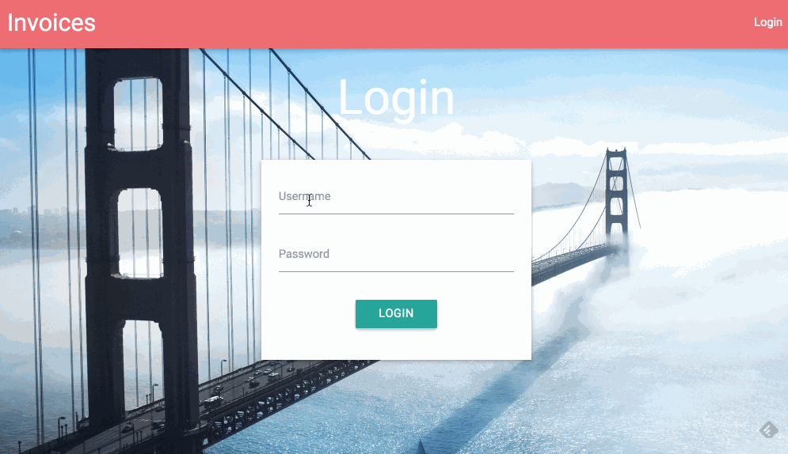

# Payments

[](https://travis-ci.org/SE-R-Test/payments)



## Configuration and Setup

There is a `config.php.example` file within the `app` folder, with the following contents:

```php
<?php

return array(
    'database' => array(
        'hostname' => '', // Database hostname
        'username' => '', // Username
        'password' => '', // Password
        'dbname' => '', // Database name
        'port' => '', // Port, 3306 by default
    ),
    'stripe' => array(
        'test' => array(
            'secret' => '', // Secret test api key
            'publishable' => '' // Publishable test api key
        ),
        'live' => array(
            'secret' => '',
            'publishable' => ''
        )
    )
);
```

Edit the config file with the necessary data, and save it as `config.php`.

### Front end

The JS and CSS is managed through [Bower](http://bower.io/). Once Bower is installed, just run `$ bower install`, to download

- jQuery
- Materialize CSS framework

## TODO

- [x] Complete spec features
- [ ] Write documentation
- [ ] Write unit tests
- [ ] Allow users to register
- [ ] Add validation to forms
- [ ] Improve UI
- [ ] More features, e.g emailing receipts, printing PDFs, etc
- [ ] Add new DB table for individual items within an invoice
